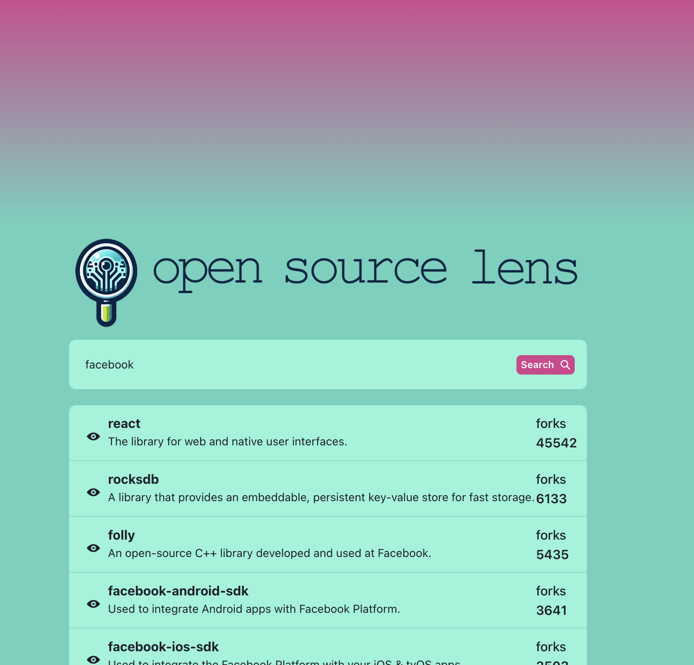

# OS Lens

This project relies on two services to be running as well as the GitHub API. The Front-end(client) 
is built with Vite/React/TypeScript. The back-end(server) is build with Fastify/TypeScript.

The server has some test coverage, however I ran out of time before I could write tests for the front-end.

## Setup
1. Requires node.js v20.9+ and npm v10.1+.
1. Setup GitHub [Personal Access Token](https://docs.github.com/en/authentication/keeping-your-account-and-data-secure/managing-your-personal-access-tokens#creating-a-personal-access-token-classic)
1. Setup server: See Server [README](./server/README.md)
1. Setup client: See Client [README](./client/README.md)
